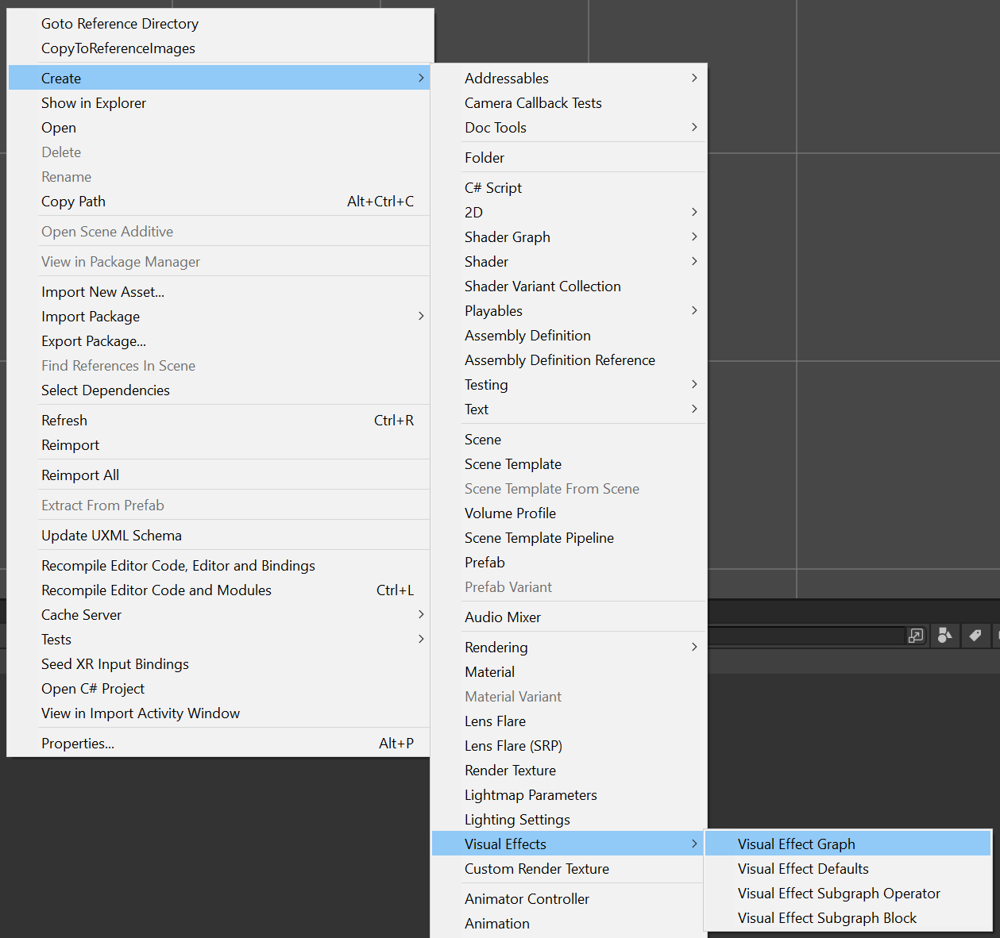
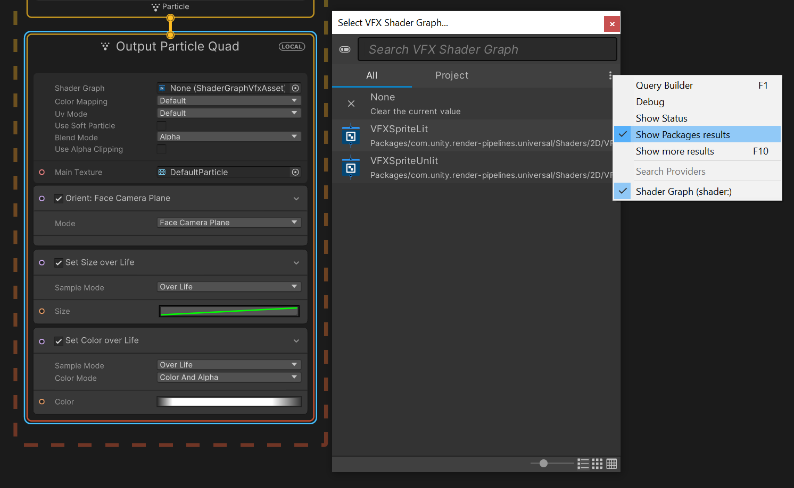
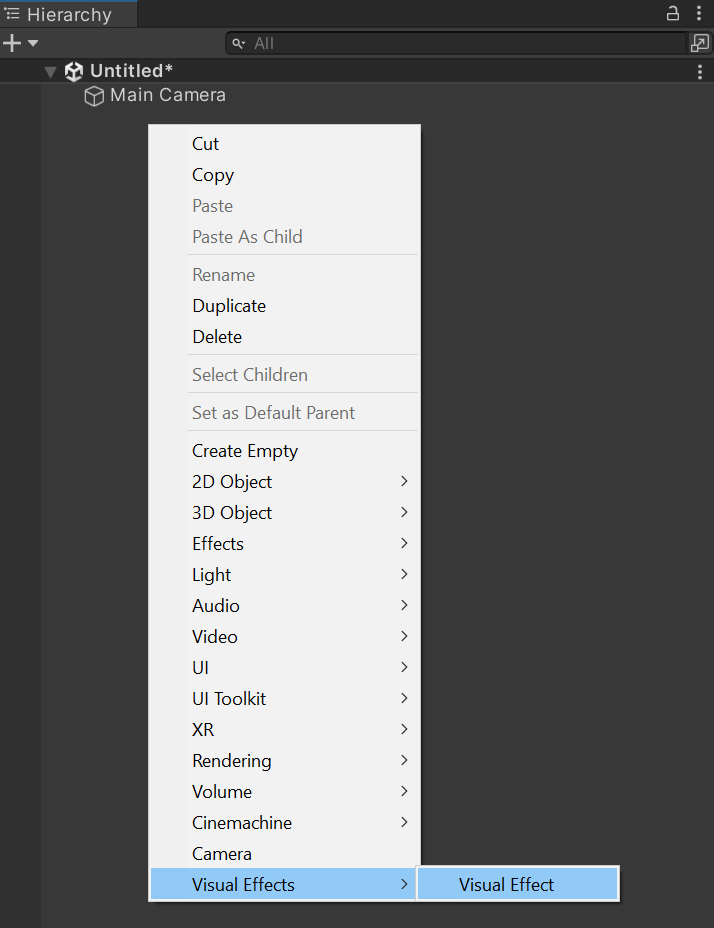

# Light a Visual Effect Graph asset 

[Visual Effect Graph assets](https://docs.unity3d.com/Packages/com.unity.visualeffectgraph@latest?subfolder=/manual/VisualEffectGraphAsset.html) are compatible with the 2D Renderer by using [Shader Graphs](https://docs.unity3d.com/Packages/com.unity.shadergraph@latest). Follow the steps below to first [create a Visual Effect Graph asset](#create-a-visual-effect-graph-asset) and then [light it with a 2D light](#light-a-visual-effect-with-2d-lights).

## Prerequisites

Refer to the Visual Effect Graph's [requirements and compatibility](https://docs.unity3d.com/Packages/com.unity.visualeffectgraph@latest?subfolder=/manual/System-Requirements.html) for the required versions of packages for your Project.

## Create a Visual Effect Graph asset

To create a Visual Effect Graph asset (VFX asset):

1. Create a new VFX asset by selecting **Assets > Create > Visual Effects > Visual Effect Graph**. The VFX asset is then created in the `Asset` folder of the Project window.
   
    

2. Double-click the asset to open the **Visual Effect Graph**. To choose a Shader Graph asset, go to the **Output Particle Quad** pane and locate **Shader Graph** and select the asset picker (circle).
   
    

3. In the **Select VFX Shader Graph** window, open the context menu (right-click) and enable **Show Packages results**.
   
   Select **VFXSpriteLit** or **VFXSpriteUnlit** depending on whether you want the Visual Effect to be affected by lights. For this example, select **VFXSpriteLit** so that you can [light the Visual Effect](#light-a-visual-effect-with-2d-lights).

## Light a Visual Effect with 2D lights

To light a Visual Effect:

1. Create a Visual Effect GameObject in the **Hierarchy** window.
   
    

2. In the **Visual Effect** properties, locate **Asset Template** and select the asset picker (circle). In the **Select VisualEffectAsset** window, select the VFX asset [created earlier](#create-a-visual-effect-graph-asset).
   
    

3. To light the Visual Effect, add [2D light(s)](Lights-2D-intro.md) to the scene.
   
    

## Additional resources

* [Using a Shader Graph in a visual effect](https://docs.unity3d.com/Packages/com.unity.visualeffectgraph@latest?subfolder=/manual/sg-working-with.html#using-a-shader-graph-in-a-visual-effect)